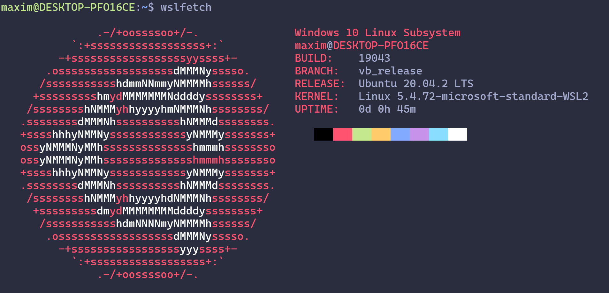
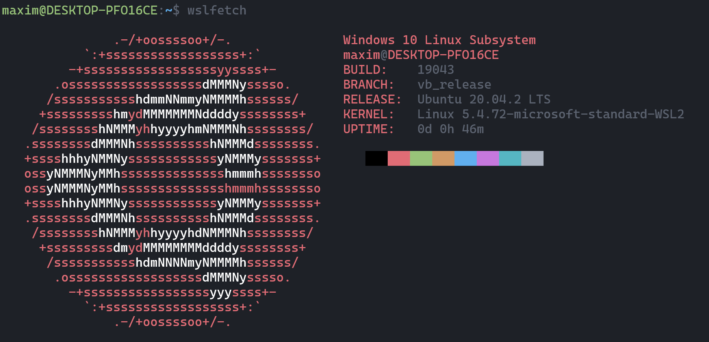
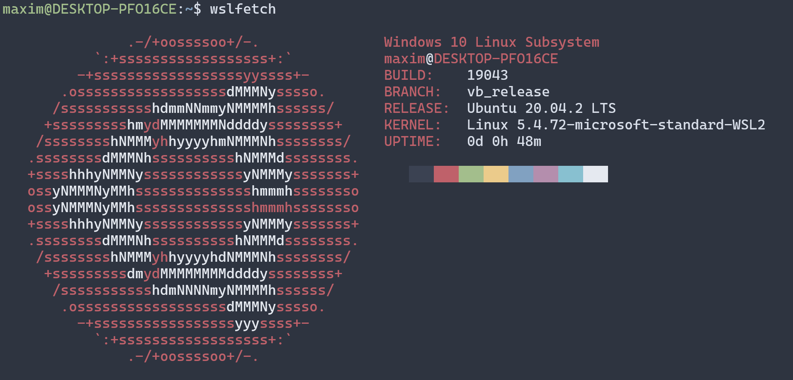
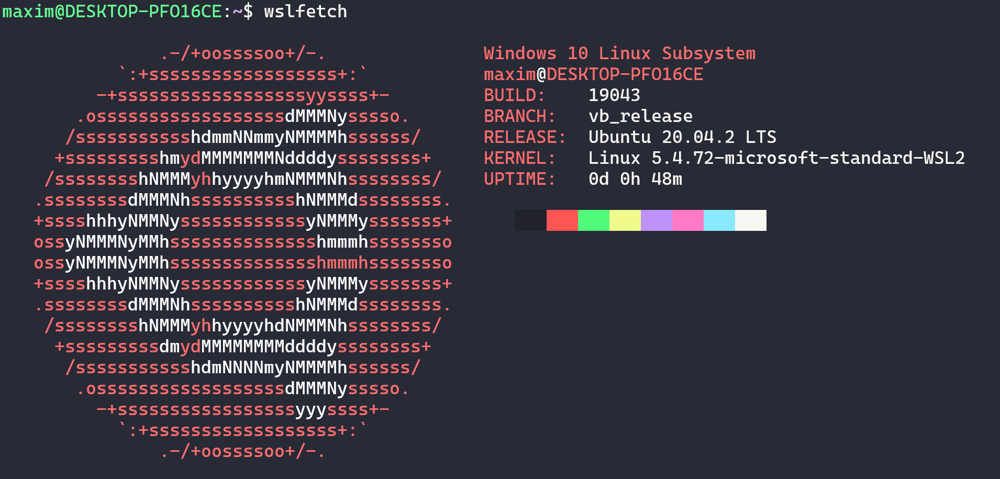
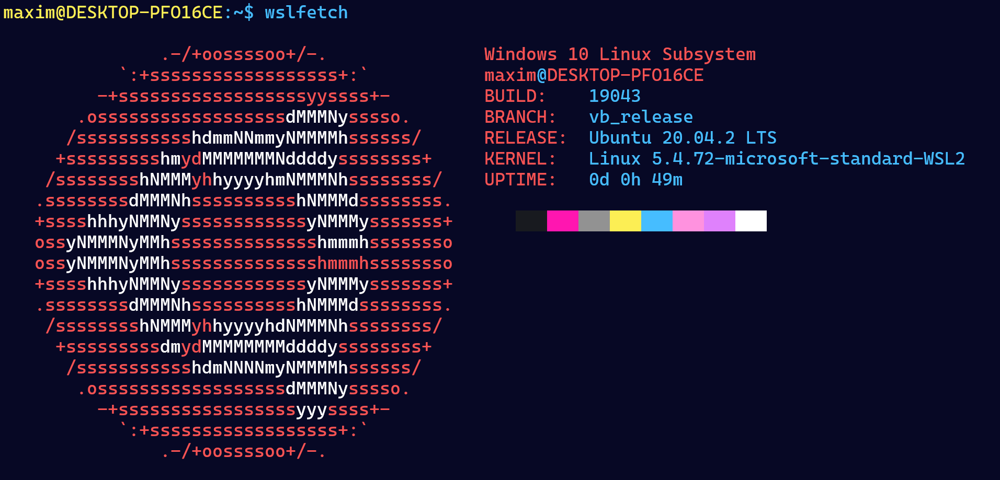
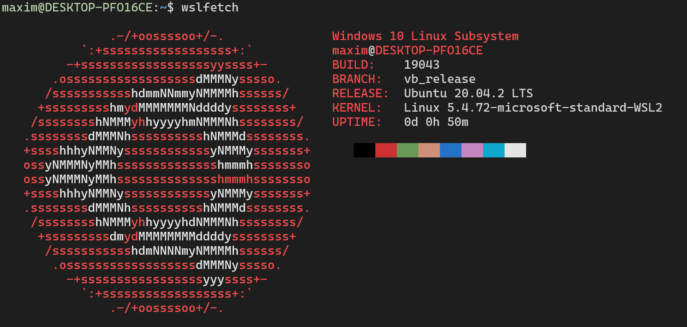
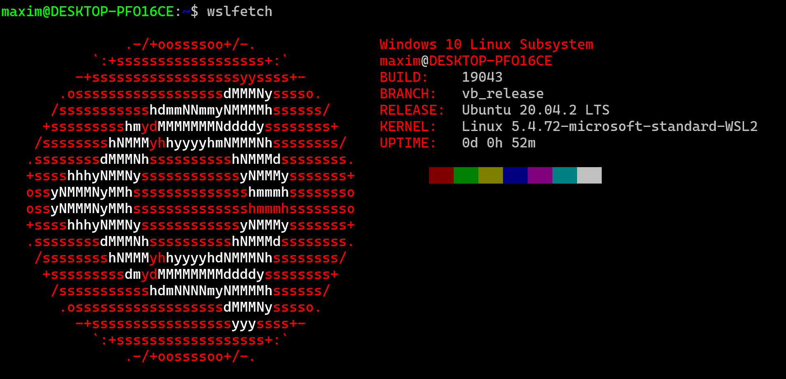

# Windows Terminal Themes

This repository is made for me to store all my themes for Witndows Terminal so that I can easily find them when setting up new machines.

## How to

1. Open Windows Terminal JSON settings.
2. Copy paste the theme or themes you want into the `"schemes": []` array.
3. Select the theme you want by typing the theme name into `"profiles": { "defaults": { "colorScheme": "<THEME_NAME>" }`

```shell
"schemes": [
    {
        "name": "Material Palenight",
        "background": "#292d3e",
        "foreground": "#a6accd",
        "black": "#000000",
        "blue": "#82aaff",
        "brightBlack": "#676e95",
        "brightBlue": "#82aaff",
        "brightCyan": "#89ddff",
        "brightGreen": "#c3e88d",
        "brightPurple": "#c792ea",
        "brightRed": "#ff5370",
        "brightWhite": "#ffffff",
        "brightYellow": "#ffcb6b",
        "cyan": "#89ddff",
        "green": "#c3e88d",
        "purple": "#c792ea",
        "red": "#ff5370",
        "white": "#ffffff",
        "yellow": "#ffcb6b"
    }
]
```

```shell
"profiles": {
    "defaults": {
        "colorScheme": "Material Palenight"
    }
}
```

## Themes

Here you can find a list of themes, how they look like and you have a small link under each one for the JSON, so you can set up in your local machine.

### Material Palenight



> JSON: [MaterialPalenight](themes/MaterialPalenight.json)

### One Dark



> JSON: [OneDark](themes/OneDark.json)

### Nord



> JSON: [Nord](themes/Nord.json)

### Dracula



> JSON: [Dracula](themes/Dracula.json)

### Retrowave



> JSON: [Retrowave](themes/Retrowave.json)

### VS Code



> JSON: [VSCode](themes/VSCode.json)

### Vintage



> JSON: [Vintage](themes/Vintage.json)
